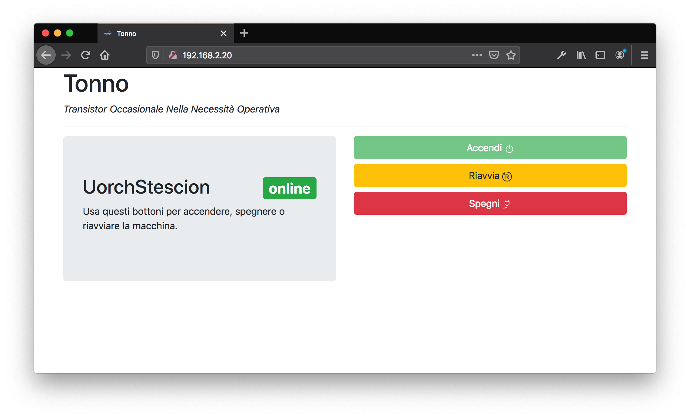

# tonno
Transistor Occasionale Nella Necessità Operativa

C'è dell'html con dentro bootstrap e javscript. Tutto spezzettato con http://davidjwatts.com/youtube/esp8266/esp-convertHTM.html# e messo dentro un file `.ino`. Prima di compilare aggiungi la libreria https://github.com/dancol90/ESP8266Ping e la board per compilare sull'esp https://github.com/esp8266/Arduino dall'ide.

Tutto molto bello, ma devi mettere SSID e password del tuo Wi-Fi e l'IP della machina target.

